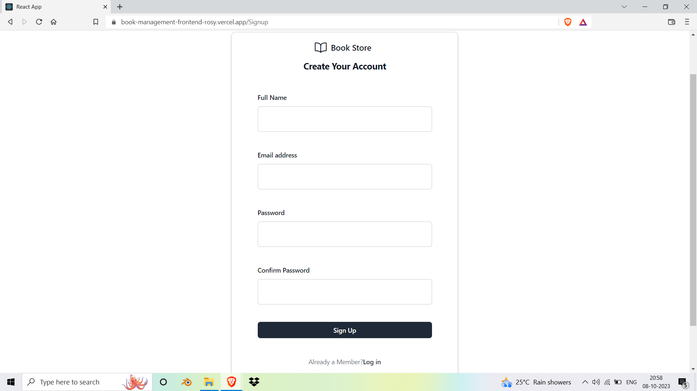
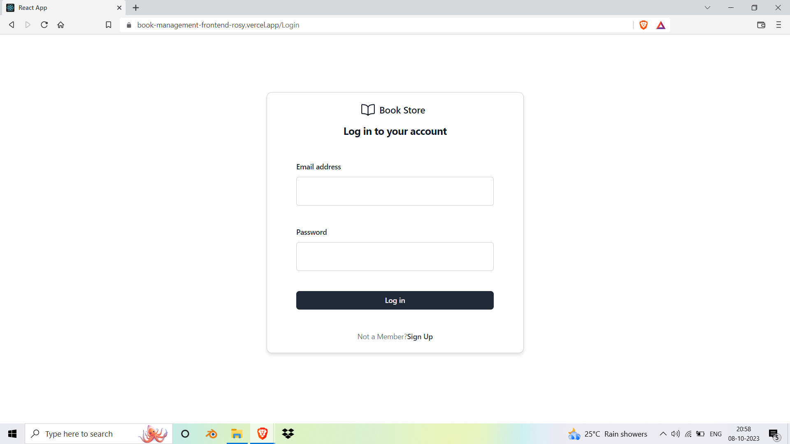
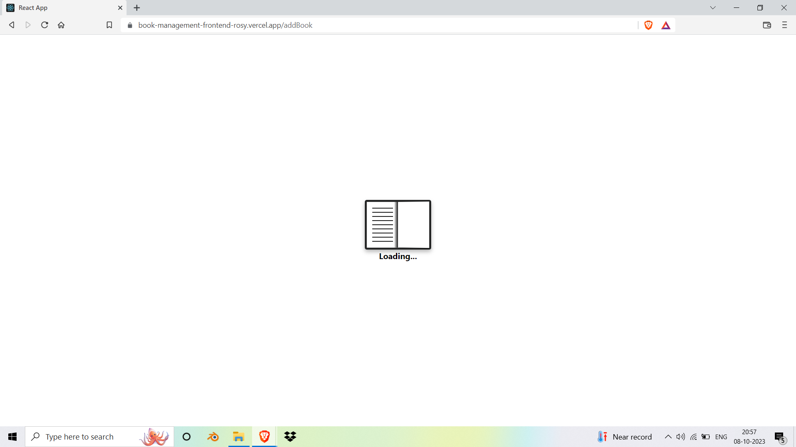
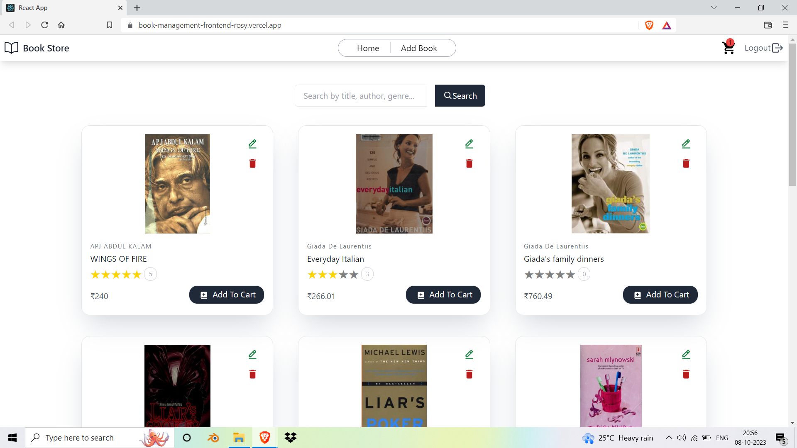
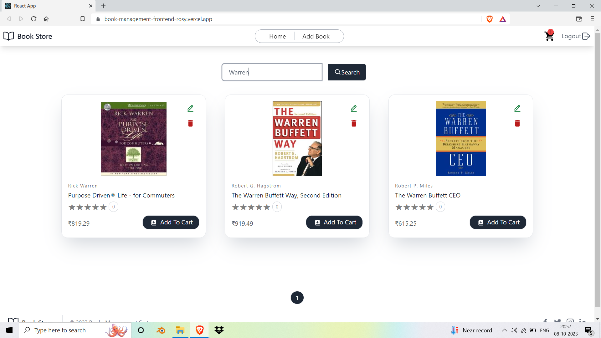
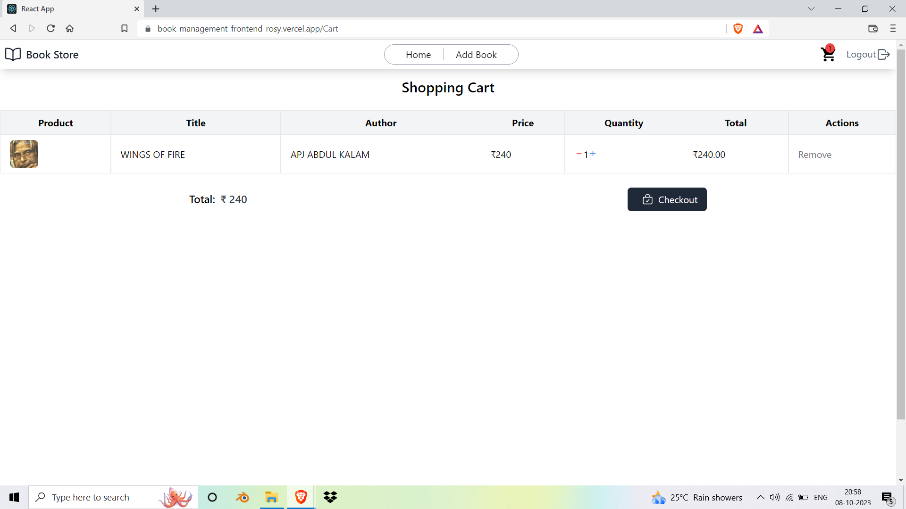
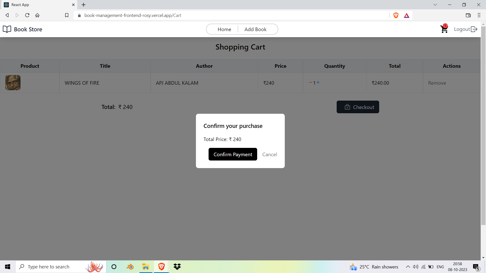

# Book Management System

This project is a Book Management System implemented using the MERN (MongoDB, Express.js, React.js, Node.js) stack, with Tailwind CSS for styling, and Python for data retrieval.

# Project Structure

The project is structured into three main folders:

# Backend

To set up the backend, follow these steps:

1. Navigate to the `backend` folder and install the required Node.js packages by running the following command:
### `npm install .`
Create a `.env` file in the `backend` folder and configure it with the following environment variables:
##### PORT=4000
##### MONGODB_URI=<Your MongoDB Connection String>
##### JWT_SECRET=<Your Secret Key>

`PORT` can be any available port number (e.g., 4000 or 5000).\
`MONGODB_URI` should be replaced with your MongoDB connection string.\
`JWT_SECRET` can be any secure string for JWT token generation.

If you have a `book_data.json` file, make sure to change the main field in the `package.json` to `insertData.js`:
"main": "insertData.js"
Populate your database with initial data from book_data.json using the following command:
### `npm run`

# Frontend

Setting up the frontend is straightforward:

1. In the frontend folder, install the required React.js dependencies by running the following command:
###   `npm install .`
Create a `.env` file in the `frontend` folder and cand specify the API URL as follows:
##### REACT_APP_API_URL=http://localhost:4000

Replace `4000` with the `PORT` number you set in the `backend's .env` file. This setting enables communication between the frontend and the backend API.

Start the frontend using the following command:
### `npm start`

# Python JSON Extract
The `python JSON extract` folder contains a Python script for fetching data from a list of ISBN numbers and generating a `book_data.json` file. To use it:
Modify the Python script to specify the ISBN numbers for which you want to fetch data.
Run the Python script to generate or update the `book_data.json` file.

## Snapshots

#### SignUp page

#### Login Page

#### Loading Page

#### Home Page

#### Details View

#### Add View

#### Pagination View

#### Search 

#### Cart

#### Checkout

#### Payment Success

This project provides a seamless way to manage and organize your book collection, utilizing modern web technologies and a user-friendly interface. Feel free to explore and customize it according to your requirements.